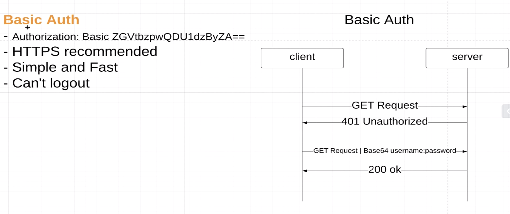
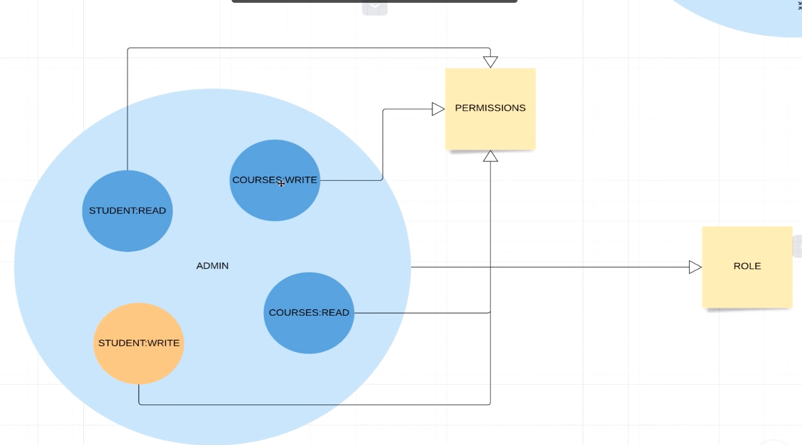
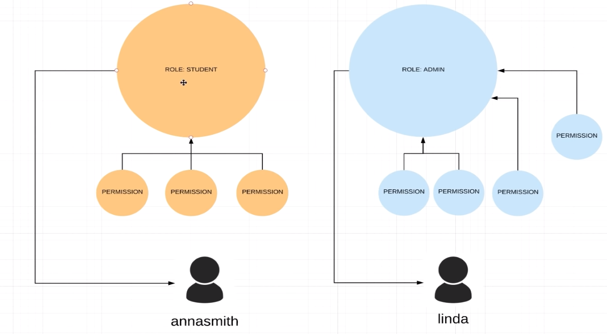

## Basic authentication



Работает как всплывающее окно в браузере, в которое мы вводим логин и пароль.

Несколько моментов

1. Мы должны где-то сохранять данные наших пользователей (база данных)
2. Мы должны хранить зашифрованный пароль (Password encoder bean)
3. Для доступа на некоторые страницы не нужно запрашивать пароль -
   настраиваем исключения в SecurityConfig
4. У разных пользователей может быть разный уровень доступа (Roles/Authorities/Permission)

### Password encoder

При добавлении бина PasswordEncoder -> spring security понимает это и будет сравнивать входящий пароль с зашифрованных,
который лежит в базе данных (то есть поступающий пароль требуется зашифровать
passwordEncoder'ом, который инжектится в auth сервис -> который уже и будет сравнивать
поступивший пароль и тот, что храниться в базе данных)

### Permissions

Действия, которые может выполнять какая то роль





Также можно назначает одному пользователю несколько ролей

Есть 2 способа организовать ограниченный доступ по ролям.

1. через Spring Security config class и antMatchers или requestMatchers
2. через @PreAuthorize аннотацию над методом контроллера и @EnableMethodSecurity
   над Spring Security config классом

Конфигурация через antMatchers

```
.csrf().disable()
.authorizeRequests()
.antMatchers("/", "index", "/css/*", "/js/*").permitAll()
.antMatchers("/api/**").hasRole(STUDENT.name())
.antMatchers(HttpMethod.POST, "/management/api/**").hasAnyAuthority(STUDENT_WRITE.getPermission())
.antMatchers(HttpMethod.PUT, "/management/api/**").hasAnyAuthority(STUDENT_WRITE.getPermission())
.antMatchers(HttpMethod.DELETE, "/management/api/**").hasAnyAuthority(STUDENT_WRITE.getPermission())
.antMatchers(HttpMethod.GET, "/management/api/**", "/api/**").hasAnyRole(ADMIN.name(), ADMIN_TRAINEE.name()) // UserDetails roles
.anyRequest()
.authenticated()
.and()
.httpBasic();
```

Если нужна csrf

```
.csrf().csrfTokenRepository(CookieCsrfTokenRepository.withHttpOnlyFalse()) // disable if our api use by non-browser clients (frontend)
.and()
```

Используется PreAuthorized

```
.csrf().disable()
.authorizeRequests()
.antMatchers("/", "index", "/css/*", "/js/*").permitAll()
.antMatchers("/api/**").hasRole(STUDENT.name())
.anyRequest()
.authenticated()
.and()
.httpBasic();
```