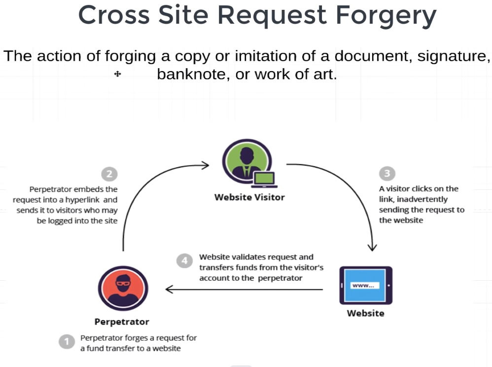
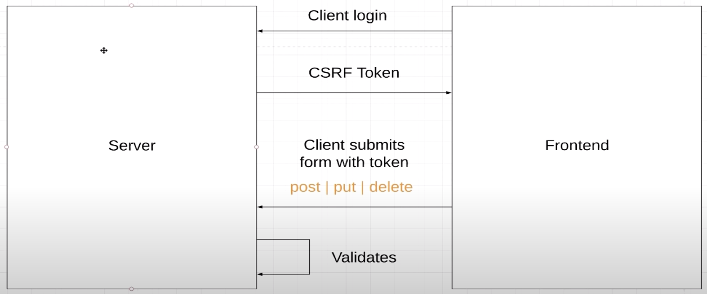

### Cross site request forgery

Злоумышленник может подделать форму банка, и передать нам ссылку, если мы кликнем
по этой ссылке и введем свои данные, то эта форма перенаправится в банк, и в зависимости
от того, что злоумышленник запрограммировал, будет переслана например какая то сумма
на его счет.

По сути мы просто отдадим злоумышленнику наш пароль и логин.

При логине на сайте сервет отсылает нам csrf токен, который сохраняется в кукис(каждый
сайт может получить от пользователя только те кукис, которые он ему отдал). Далее при заполнении
формы клиент будет отсылать csrf токен вместе с ней и сервер уже будет сравнивать их.

Но есть проблема, что мошенник просто может узнать наш пароль по фейковой форме
и попытаться залогиниться от нашего имени, защитой может служить двухфакторная аутентификация,
благодаря которой, сервер будет знать, когда отправлять новый csrf токен(если вы залогинились с другого устройства,
у которого еще нет в кукис csrf токена этого сайти) или не отправлять, когда мошенник пытается
зайти от вашего имени он не сможет этого сделать, так нужно подтверждение, например, по почте
(поэтому важно иметь разные пароли от разных сервисов).

Если ваше приложение используется не браузерными клиентами, то можно отключить
csrf защиту