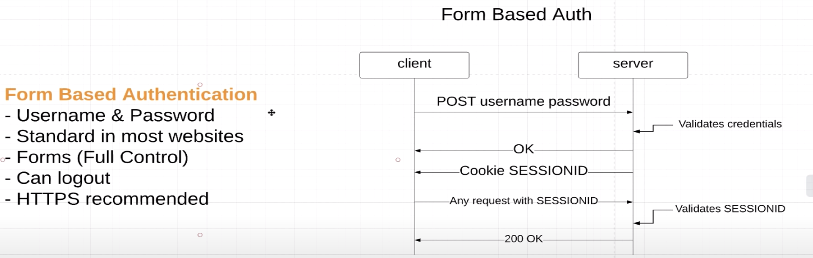

### Form based authentication



Стандартная аутентификация на многих сайтах, пользователь отсылает логин и пароль,
а сервер в ответ отсылает header SESSIONID и браузер сохраняет его в кукис.
Далее, при каждом запросе на сервер, он проверяет валидность сессии, если не валидна, то
нужно еще раз ввести логин и пароль.

SESSIONID храниться в базе данных

```
http
.csrf().disable() // disable if our api use by non-browser clients (frontend)
.authorizeRequests()
.antMatchers("/", "index", "/css/*", "/js/*").permitAll()
.antMatchers("/api/**").hasRole(STUDENT.name())
.anyRequest()
.authenticated()
.and()
.formLogin() // SESSIONID default 30 min store
// login
.loginPage("/login").permitAll()
    .defaultSuccessUrl("/courses", true)
    .passwordParameter("password")
    .usernameParameter("username")
.and()
// remember me feature
.rememberMe() // make SESSIONID store 2 week default
    .tokenValiditySeconds((int) TimeUnit.DAYS.toSeconds(21))
    .key("somethingverysecured")
    .rememberMeParameter("remember-me")
.and()
// logout
.logout().logoutUrl("/logout")
    .logoutRequestMatcher(new AntPathRequestMatcher("/logout", "GET"))
    .clearAuthentication(true)
    .invalidateHttpSession(true)
    .deleteCookies("JSESSIONID", "remeber-me")
    .logoutSuccessUrl("/login");
```

По дефолту logout GET метод. Если мы используем csrf защиту, то нужно
либо сделать logout POST методом, либо добавить следующую строчку
`.logoutRequestMatcher(new AntPathRequestMatcher("/logout", "GET"))`