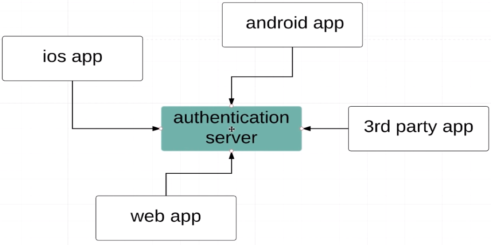
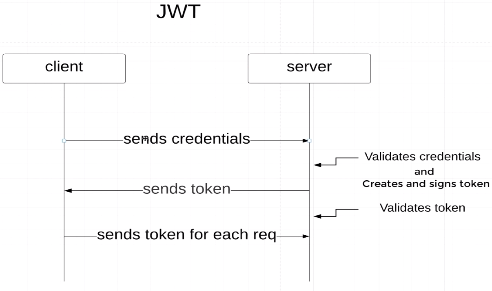
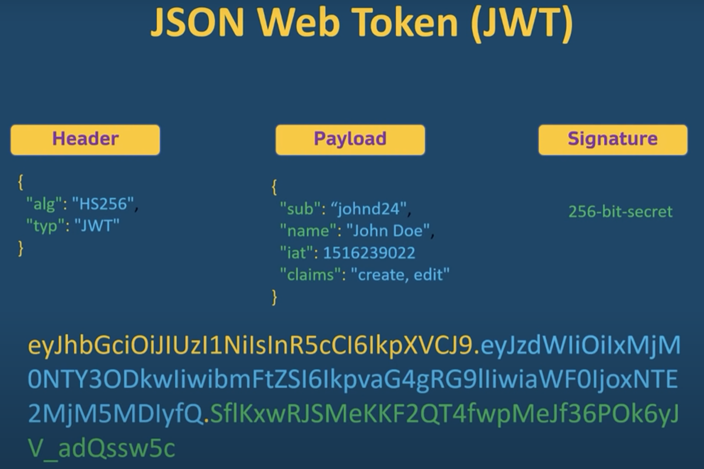

### JSON Web Token

Если у нас один общий auth server для разных приложений, то можно использоваться jwt
токен, чтобы не проходить аутентификацию на каждом их сервисов.

Токен состоит из 3 частей
- header - информация о токене (алгоритм шифрования)
- body(payload) - информация о пользователе (username, password, authorities...)
- verify signature - секретный ключ, благодаря которому можно расшифровать header и body

